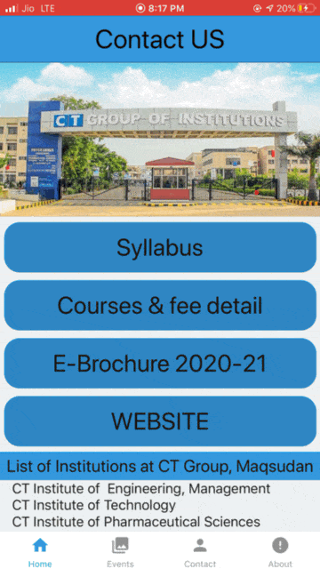
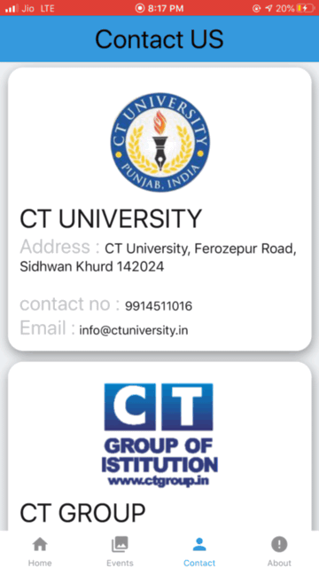

# ct-group react app
CT Group of Institutions, Jalandhar, collage that is established in 1997

                                         

## USER INTERFACE REQUIREMNTS
➢ Main Screen:
Main Screen shows the menu list (syllabus, prospectus, website) and collage
infracture.
➢ event Screen:
This Page shows the events that happened in collage.
➢ Contact screen:
 This page shows the other branches of ct group and its contact information.
➢ About screen:
This screen shows the about the institutions and its social links.
➢ Bottom tab screen:
This tab use to navigate between screens and it has logo with textUSER INTERFACE REQUIREMNTS
➢ Main Screen:
Main Screen shows the menu list (syllabus, prospectus, website) and collage
infracture.
➢ event Screen:
This Page shows the events that happened in collage.
➢ Contact screen:
 This page shows the other branches of ct group and its contact information.
➢ About screen:
This screen shows the about the institutions and its social links.
➢ Bottom tab screen:
 This tab use to navigate between screens and it has logo with text.
 
### Tech

Dillinger uses a number of open source projects to work properly:

* [node.js] - evented I/O for the backend
* [react native] - cross platform app environment !
* [git] - git CMD to installs dependencies
* [material Icons] - all kind of icons 
* [visual studio code ] - awesome text editor by Microsoft
 
## 📋 Requirements

React Native apps may target iOS 10.0 and Android 4.1 (API 16) or newer. You may use Windows, macOS, or Linux as your development operating system, though building and running iOS  emulator apps is limited to macOS. Tools like [Expo](https://expo.io) can be used to work around this.
